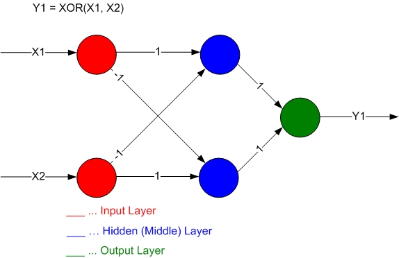
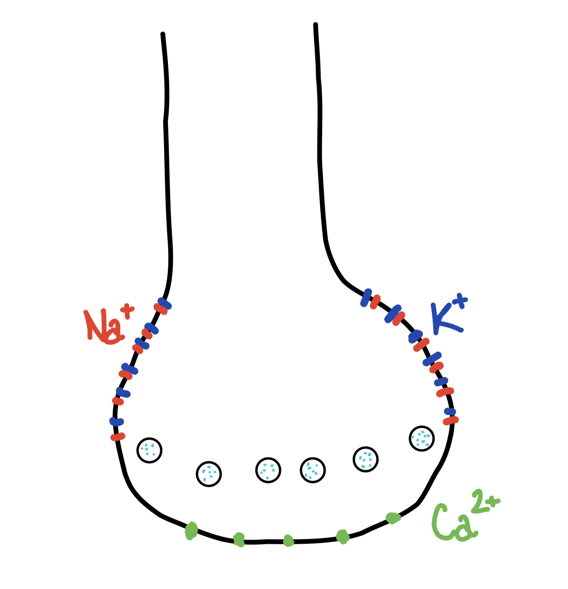
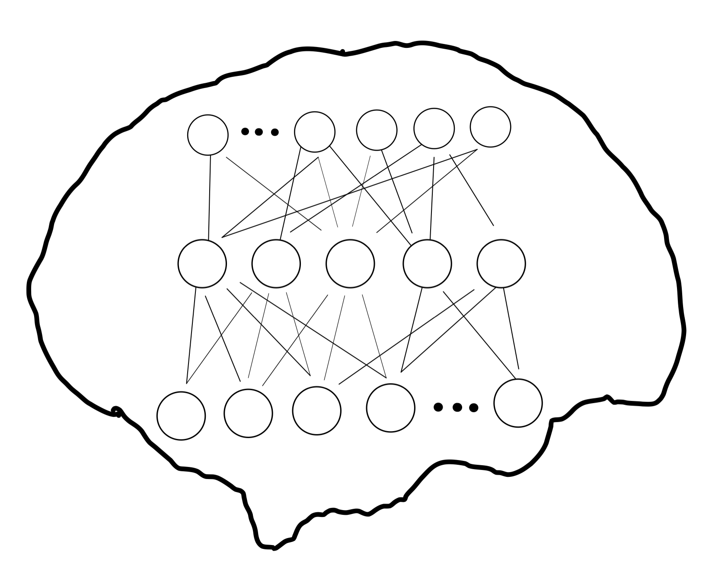

<figure class="video_container">
  <iframe width="560" height="315" src="https://www.youtube.com/embed/dhmUPTDVaRY" title="YouTube video player" frameborder="0" allow="accelerometer; autoplay; clipboard-write; encrypted-media; gyroscope; picture-in-picture" allowfullscreen></iframe>
</figure>

Artificial neural networks, AI, machine learning, deep learning, or whatever you want to call it (true, they’re not the same thing, but people do use them interchangeably), have achieved incredible things in the last couple of decades. Just imagine, a deep neural network can recognize countless different objects in pictures, sometimes even better than humans can (don’t suppose you’re going to beat a DNN at Where’s Waldo), they can replicate the music styles of famous composers and create new pieces that neither one of us could distinguish from the original, and they can generate text to answer questions and make you feel really uncomfortable about the possibility of its superior intelligence (not to mention the work done in deep reinforcement learning achieving superhuman performance in games and countless other tasks). It’s all truly amazing, but… is it really intelligent? Well, I won’t get into too much detail here since I actually have something to talk about, so to make a long story short, the simple fact is that AI is still very limited, especially when compared to biological computers, AKA brains. To make a deep neural network really good at something, here’s what you need (and what can go wrong): 
1. a lot of good training data (“good” meaning it actually represents a large variety of the population of possible data and not just a subset that can share a common flaw)
2. power consumption (depends on specific use case, but it can go into thousands of watts)
3. the mental capacity to deal with problems like overfitting, vanishing/exploding gradients, bias, and the fact that when you have a problem and fix it in the network, you usually need to retrain the whole thing from scratch (ok that sounded way too pessimistic and lot less fun than it actually is; I’d pick debugging a neural network over the backend of a website any time).

The brain, on the other hand, is really good at learning from a small set of data, and it can easily transfer insights from one field to another without the need for expensive power consumption, since the brain runs on less than 20 watts. I’ve already mentioned the possible next steps AI research needs to take to get closer to the desired (or undesired, who knows) emulation of human intelligence in a previous post, but let’s get deeper into one of the beforementioned steps, specifically rethinking the architecture of neural networks by drawing inspiration from dendrites (gotta love those dendrites, am I right).
So, what’s so special about dendrites? Well, many things. Firstly, the different types of dendrites allow for a rather complex architecture in a very small space, thus endowing the brain with the state-of-the-art computational abilities it has. Not convinced yet? Consider this, a single neuron connected to multiple dendrites (both input and output) can act as multiple artificial neural networks! To put it in more technical terms, a single neuron (pyramidal neurons specifically)  is capable of solving non-linear functions. A classic example (in computer science at least) is the XOR function, which is a classification task typically solved by a neural network with at least one hidden layer.

 Dendrites can be separated into two types, active and passive. Active dendrites are the ones we generally learn about at school, these are the ones that send signals to neurons and generate the dendritic spikes we talked about last time. Passive dendrites, on the other hand, act more like filters and they regulate the strength of incoming signals. This is really important, since you can’t just have everything firing everywhere; regulation of signals is just as important for our cognitive abilities as their generation. 
Secondly, (this is going to be a long one isn’t it) dendrites have various ion channels which transform the incoming signals. You can think of it this way: in a deep neural network, each node has some activation function which transforms the inputs it receives (and unless you found a specific activation function works really well on the task you’re solving, you’re most likely going to use ReLU or LeakyReLU). Now, each node in a DNN has exactly one activation function whereas dendrites can have as many. This again makes a single neuron an extremely powerful processing unit.

The last point I want to touch on is plasticity. Neural networks represent the best current technology has to offer, but they’re extremely static in comparison to their biological counterparts. Each artificial neuron always processes information from the same input connections and sends the transformed signal further down the network. Dendrites, however, are highly malleable. Connections can get weaker or stronger, new connections can be formed, and synapses influence each other based on their proximity, regardless of whether there’s a signal running through all of them. You might have heard that saying “neurons that fire together, wire together”. It’s easy to point out the limitations of artificial neural networks by saying that the brain rewires itself, it’s harder to actually replicate that behavior in code.

There are many differences between artificial intelligence systems and the ones seen in living things, but thanks to the increasing demand for AI, research into replicating dendritic architecture in machine learning is already delivering [promising results](https://arxiv.org/pdf/2003.03229.pdf). The question remains whether this approach of modifying the current cutting-edge models with extra activation functions or something else enabling more complex filtering of signals or plasticity is the correct way to go about it. While AI seems intuitively analogous to biological brains, there are so many things in which it is fundamentally different. 

For instance, learning in most deep learning models is enabled by the backpropagation of errors through the entire network, calculated from the distance between the targets and the predictions, however, that doesn’t seem to be like the learning in humans, or at least not all learning. Especially when discussing classification tasks, humans learn to distinguish different objects by finding regularities in the inputs they receive and that’s how they form general ideas and concepts. You have some idea of a general car in your head and when you encounter a vehicle you’ve never seen before, you can use that representation to instantly determine whether what you’re looking at is a car or a plane or a ship, and you didn’t acquire that knowledge by getting that prediction wrong a million times and then incrementally updating your synapses, instead you’ve learned that because the “car synapses” got stronger the more cars you saw. In other words, updates in your brain occurred based on input regularities rather than prediction errors. 
As a last note before we leave it for today, once we successfully replicate the dendrite architecture to create novel artificial neural networks with great performance, at one point or another, we’ll need to address the hardware problem, and that is that all these ANN’s are running on GPUs and CPUs, which are made of binary transistors. On the other hand, solutions might be [on the horizon](https://www.researchgate.net/publication/342983810_Multi-terminal_ionic-gated_low-power_silicon_nanowire_synaptic_transistors_with_dendritic_functions_for_neuromorphic_systems).
