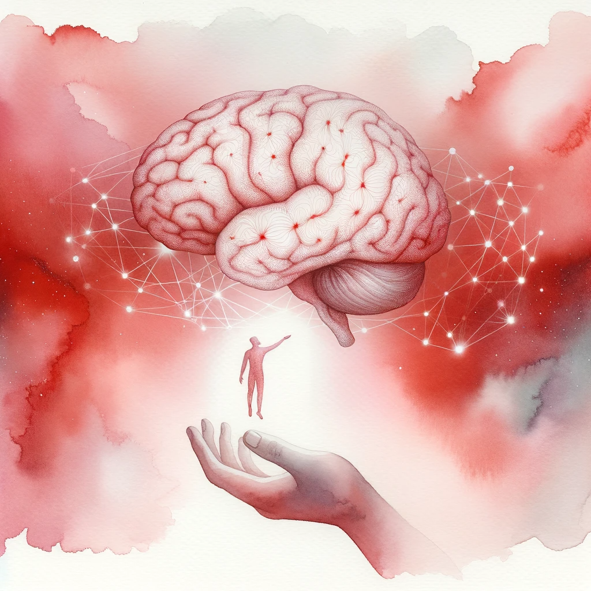

I am currently a researcher working at the intersection of AI, neuroscience, and physics. I am particularly interested in applying various techniques and formalisms to study emergent properties of complex systems and in developing new tools to model and interface with self-organizing entities in diverse state-spaces. 

Previously, I worked in DeSci on systems engineering for [knowledge sharing protocols](https://opsci.io/) and in [Decentralized AI](https://app.algovera.ai/). I am researching applied active inference at the [Active Inference Institute](https://activeinference.org/).

**Driving Questions**
* What can the study of complex systems tells us about the development of systems at different spatiotemporal scales?
* What is intelligence?
* How do we create autonomous systems that evolve to solve important problems?
* How do we integrate different approaches to thinking about biological systems? And how do we integrate biology with physics and information theory?

