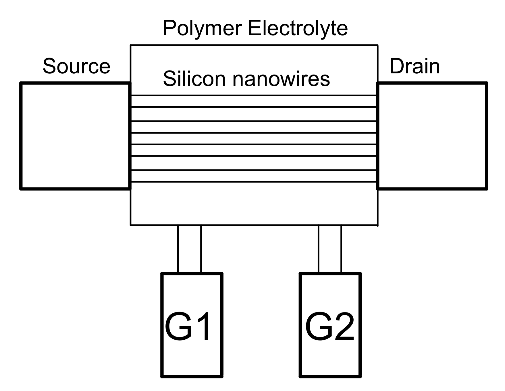
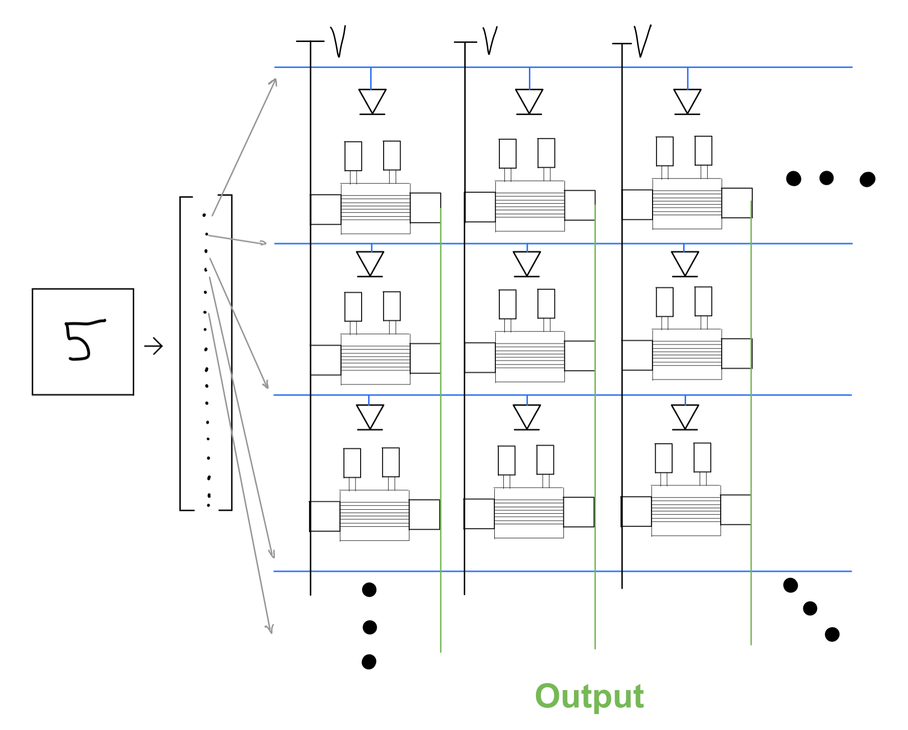

I’ve talked about how artificial intelligence can be improved by emulating the biological structure and properties of neurons and brains in general. 

On one hand, this approach seems to be the best way to go about it. We already have a number of benchmark tasks and a plethora of machine learning models that solve them with great accuracy. Plus, with the vast developer support of the commercially used deep learning libraries such as Tensorflow or Pytorch, it’s relatively easy to play around with different model architectures and see what the models do. While the actual modelling of neurons is a bit more complicated than that, it is still a reasonable approach to take as a means of creating artificial brains.

On the other hand, this process might be slightly counterintuitive. While it is convenient to think of our brains as biological equivalents to computers, in doing so we forget that the brain’s software does not seem to boil down to binary code. The information I used in my previous posts seems to suffice to make this point; if we compare a dendrite with a transistor, we notice that a transistor only produces binary information, while a dendrite has different kinds of electrochemical spikes coming through, plus its connections to other neurons can get weaker or stronger.

The point I am slowly getting to is that while it might be beneficial to replicate the different properties of the brain in code, at the same time, we need to think about the actual hardware the software is running on. Research in this field is already showing interesting results and I’d like to share some of them here.

The results of one such research yielded the multi-terminal ionic-gated low-power silicon nanowire synaptic field-effect transistor, or IGNWFET (catchy, right?). Let’s break this down. This is the schema of the IGNWFET. The two independent ionic-gates act as pre-synapses and the silicon nanowires send the equivalent to a post-synaptic signal (created by combining the signal from the two gates). The polymer electrolyte displaces the ions travelling from the two gates, which gives the nanowires memory capability (achieved by the displacement of ions). Essentially, think of the polymer electrolyte and the silicon nanowires as two layers capable of conducting ions. The idea behind this is to emulate the properties of a neuron cell membrane, which we can vaguely imagine as having similar properties to those of a capacitor.

The IGNWFET has a number of neuron-like properties worth mentioning. The first one is the transition between short-term and long-term potentiation (STP and LTP). This mechanism enables the strengthening of synapses in the brain, and in the case of IGNWFETs, this means that to a certain extent, they can replicate plasticity. The second property, also aiding plasticity, is paired pulse facilitation (PPF), which increases the post-synaptic signals if they are received shortly after each other. Conversely, IGNWFETs are able to filter high frequency signals, which is analogous to some of the inhibitory properties of neurons.

Ok, so it seems this oddly named transistor has some promising tricks up its sleeve, but what can it actually do? Well, to start with, a single IGNWFET has been able to perform Addition and Subtraction computations, similar to biological dendrites (though they are still a bit more advanced).

The field of research concerned with emulating the characteristics of the brain is called neuromorphic computing, so anything that is produced in this field should in some way get us closer to creating an artificial brain, with capabilities similar to those of human brains. Unsurprisingly, the IGNWFETs were used to construct a neural network which was trained on the classic MNIST digit classification task.

What the team developing the IGNWFETs did differently, however, is that they didn’t approach the MNIST digit classification as a supervised learning problem, but rather as an unsupervised learning problem. The key difference between the two is that models in supervised learning are trained on a set of images along with their corresponding labels, and they learn to add the correct label to the corresponding image. Unsupervised learning, on the other hand, gets rid of the labels, and instead the models learn to cluster data with similar characteristics together, so the while the model doesn’t know that an MNIST image with the number 5 should be labeled with the number 5, it will know that it is similar to all the other 5’s in the dataset.

The model created from a structure of multiple IGNWFETs has been trained on the MNIST digit dataset, and after 60000 training iterations, it reached an accuracy of 84.6%, which is comparable to the performance of single-layer neural networks running on other synaptic based devices. Of course, when compared to supervised learning models, the current state-of-the-art still dominates, but a comparison is not even appropriate in this case, since this research is primarily concerned with the hardware of neuromorphic systems.
While we are still not at the level of replicating all the different biological processes of the brain, the IGNWFET shows without a doubt that we are slowly getting there.

Sources: https://www.researchgate.net/publication/342983810_Multi-terminal_ionic-gated_low-power_silicon_nanowire_synaptic_transistors_with_dendritic_functions_for_neuromorphic_systems
