This is part 2 of my blog series covering the contents and exercises from [Neuronal Dynamics](https://neuronaldynamics.epfl.ch/). Last time, we went over the notion of the Leaky Integrate and Fire neuron and we explored the accompanying Python exercises. Today, we're looking at the Exponential Integrate and Fire model of a neuron, which fits into a broader category of nonlinear neuron models.

A general nonlinear integrate and fire neuron is described by the following equation:

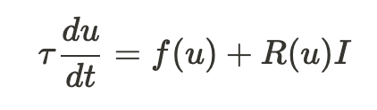

differential equation modelling a general nonlinear neuron

where $u$ is the memebrane potential (measured in mV), $\tau$ is the time constant, $f(u)$ is a voltage function, $R(u)$ is input resistance, and $I$ is the input current. The Exponential IF neuron is then modelled by:

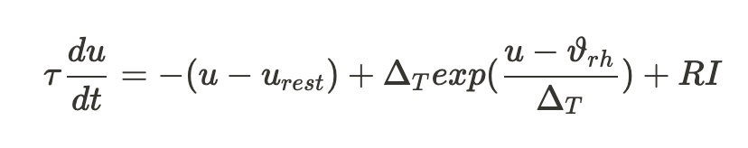

differential equation modelling the exponential integrate-and-fire neuron

which once again has a leaky passive membrane potential $(u-u_{rest})$ as the LIF neuron, but there is also the exponential nonlinearity with threshold voltage $\vartheta_{rh}$ and a sharpness parameter$\Delta_T$, which is essentially describing the shape of the voltage curve (as $\Delta_T\rightarrow0$, voltage evolution becomes identical to the LIF voltage). If we compare this to the LIF model:

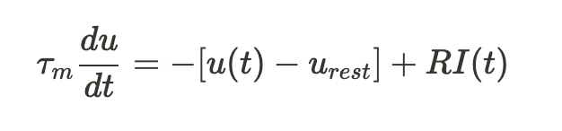

differential equation modelling the leaky integrate-and-fire neuron

### 2.1 Rheobase threshold

The first exercise is about the rheobase threshold. Firsly, what is the rheobase threshold? The leaky integrate-and-fire model introduced the concept of a firing threshold, i.e. a voltage which, once reached, elicited a spike. In the exponential integrate-and-fire model, this threshold is still present, but on top of that, there is another threshold called the rheobase threshold. This is significantly lower than the firing threshold and it describes the voltage after which a firing event can occur. This is best explained visually:

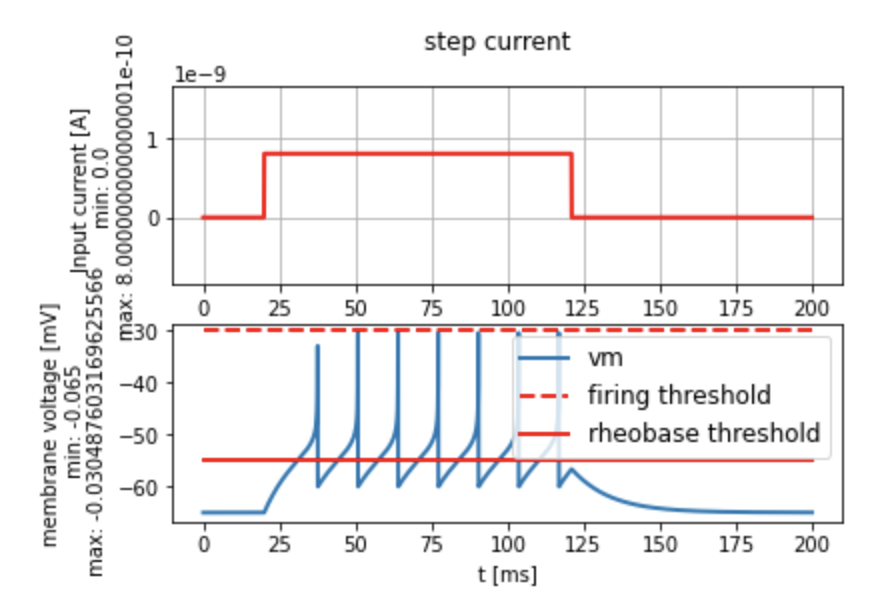

As you can see from the bottom plot, if the current wasn't large enough to reach the rheobase threshold, no spike firing would occur. In the simplest terms, the exponential integrate-and-fire neuron has two voltage thresholds that need to be reached for firing to occur.

With that, let's take a look at the first question in the [Python exercises](https://neuronaldynamics-exercises.readthedocs.io/en/latest/exercises/exponential-integrate-and-fire.html). Given the initial code that generates the plot above, we are asked to think about what will happen to the voltage-time curve if we increase the firing threshold from -30mV to 10mV. Presumably, less spikes, right? Well, not really; if we consider the definition of the rheobase threshold as given in [Neuronal Dynamics](https://neuronaldynamics.epfl.ch/), it indicates the **maximal voltage that can be reached with constant current injection before the neuron starts repetitive firing**. In that case, the repetitive firing should be independent of the actual firing threshold and we should see the same number of spikes as the rheobase threshold remains unchanged. This is the code for simulating the EIT neuron:

```python
v_spike = +10.0 * b2.mV

input_current = input_factory.get_step_current(
    t_start=20, t_end=120, unit_time=b2.ms, amplitude=0.8 * b2.namp)

state_monitor, spike_monitor = exp_IF.simulate_exponential_IF_neuron(
    I_stim=input_current, simulation_time=200*b2.ms, v_spike=v_spike)

plot_tools.plot_voltage_and_current_traces(
    state_monitor, input_current,title="step current",
    firing_threshold=v_spike)
print("nr of spikes: {}".format(spike_monitor.count[0]))
```

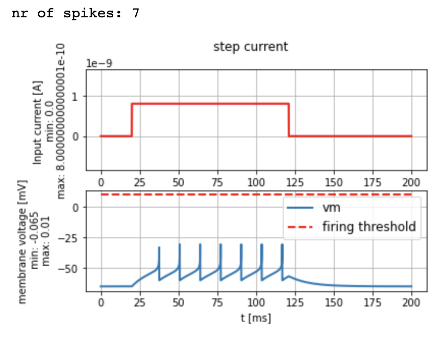

As it turns out, the number of spikes is the same as before. The following question then asks to compute the minimal amplitude I_rh of a constant input current such that the neuron will elicit a spike. To do this, we're going to use the equation from the beginning of this post:


differential equation modelling the exponential integrate-and-fire neuron

In the leaky integrate-and-fire case, we only needed to consider the differeference between the threshold voltage and the rest voltage, however, this time we also have the exponential term. Firstly, what is the threshold we want to reach to get a spike? Based on the plot above, it is not the firing threshold, so what's left is the rheobase threshold. Secondly, let's consider the role of the sharpness parameter $\Delta_T$ for a moment. This parameter really only affects the shape of the voltage curve once we reach the rheobase threshold.


This is a plot from [Neuronal Dynamics](https://neuronaldynamics.epfl.ch/) showing the effect of different values of $\Delta_T$. As you can see, the sharpness parameter doesn't really play a significant role up until the threshold is reached, so for our calculation, let's assume $\Delta_T\rightarrow0$, which will eliminate the exponential term from the differential equation (if you're worried about dividing by zero in the exponential, note that we are already assuming that $u=\vartheta_{rh}$, so the exponential dissappears; also, the graph above shows how decreasing the sharpness factor eliminates the exponential nonlinearity). What we're left is again the differential equation for the leaky integrate-and-fire neuron!


differential equation modelling the leaky integrate-and-fire neuron

And from the first blog post, we know this has the following solution:

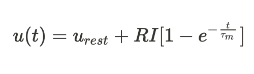

function of membrane voltage for the leaky integrate-and-fire neuron

Since we're back to almost the same problem as in the first post, we know we can calculate the minimum current using Ohm's law, hence

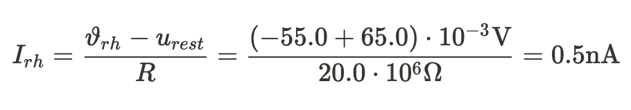

calculation of the minimum input current to reach the rheobase threshold

Putting this current to our code:

```python
input_current = input_factory.get_step_current(
    t_start=20, t_end=120, unit_time=b2.ms, amplitude=I_rh)

state_monitor, spike_monitor = exp_IF.simulate_exponential_IF_neuron(
    I_stim=input_current, simulation_time=100*b2.ms, v_spike=v_spike)

plot_tools.plot_voltage_and_current_traces(
    state_monitor, input_current,title="step current",
    firing_threshold=v_spike)
print("nr of spikes: {}".format(spike_monitor.count[0]))
```

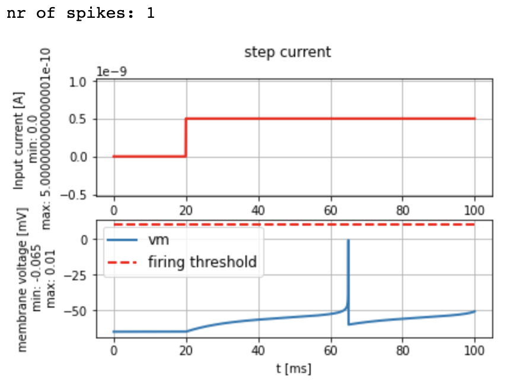

the voltage-time graph for 0.5nA input current

With the minimal input current calculated, we are getting precisely one spike, as required. As a side note, our approach is actually only a rough approximation of the minimum input current. It turns out that the actual minimum input current is as low as 0.44nA, which I tested in code. Presumably, this is due to us neglecting the sharpness factor.

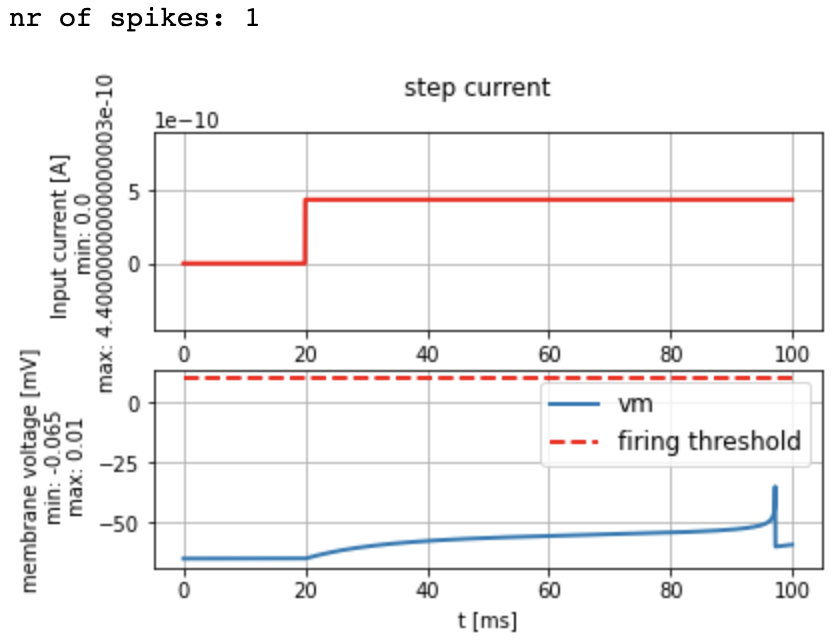

the voltage-time graph for 0.44nA input current

### 2.2 Strength duration curve

This exercise asks us to experimentally determine the minimum input currents for different durations. You might have noticed that us using Ohm's law to determine the minimal current was equivalent to rearranging the solution to the differential equation for I and assuming t approaches infinity so that the exponential term dissappears. This assumption is only valid for an infinite-duration input current, but for short pulses, the minimum current will be different. Since we are asked to determine these new input currents experimentally, I opted for the brute force Python way, making a for loop and going through all the values.

```python
i_s = [0, 2, 6]
amps = []
for i in i_s:
    spike_count = 0
    amp = 0.
    print("i: {}".format(i))
    while spike_count == 0:
        amp += 0.01
        durations = [1,   2,    5,  10,   20,   50, 100]
        min_amp =   [amp, 4.42, amp, 1.10, .70, .48, amp]

        t=durations[i]
        I_amp = min_amp[i]*b2.namp
        title_txt = "I_amp={}, t={}".format(I_amp, t*b2.ms)

        input_current = input_factory.get_step_current(t_start=10, t_end=10+t-1, unit_time=b2.ms, amplitude=I_amp)

        state_monitor, spike_monitor = exp_IF.simulate_exponential_IF_neuron(I_stim=input_current, simulation_time=(t+20)*b2.ms)
        spike_count = spike_monitor.count[0]
    print("nr of spikes: {}".format(spike_monitor.count[0]))
    print("min_amp: {}".format(amp))
    amps.append(amp)
```

This approach yielded the correct amplitudes, as shown below.

```python
i=0  #change i and find the value that goes into min_amp
durations = [1,   2,    5,  10,   20,   50, 100]
min_amp =   [8.58, 4.42, 1.93, 1.10, .70, .48, 0.43]

t=durations[i]
I_amp = min_amp[i]*b2.namp
title_txt = "I_amp={}, t={}".format(I_amp, t*b2.ms)

input_current = input_factory.get_step_current(t_start=10, t_end=10+t-1, unit_time=b2.ms, amplitude=I_amp)

state_monitor, spike_monitor = exp_IF.simulate_exponential_IF_neuron(I_stim=input_current, simulation_time=(t+20)*b2.ms)

plot_tools.plot_voltage_and_current_traces(state_monitor, input_current,
                                           title=title_txt, firing_threshold=exp_IF.FIRING_THRESHOLD_v_spike,
                                          legend_location=2)
print("nr of spikes: {}".format(spike_monitor.count[0]))

plt.plot(durations, min_amp)
plt.title("Strength-Duration curve")
plt.xlabel("t [ms]")
plt.ylabel("min amplitude [nAmp]")
```

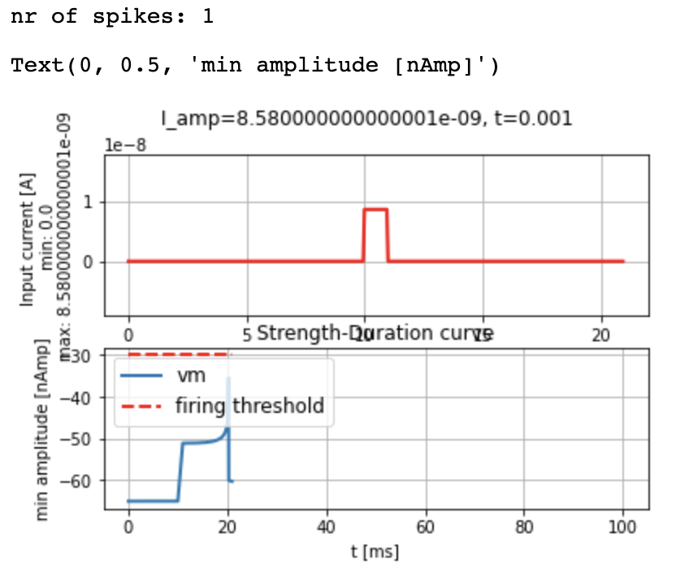

the amplitude-time graph for 1ms current duration

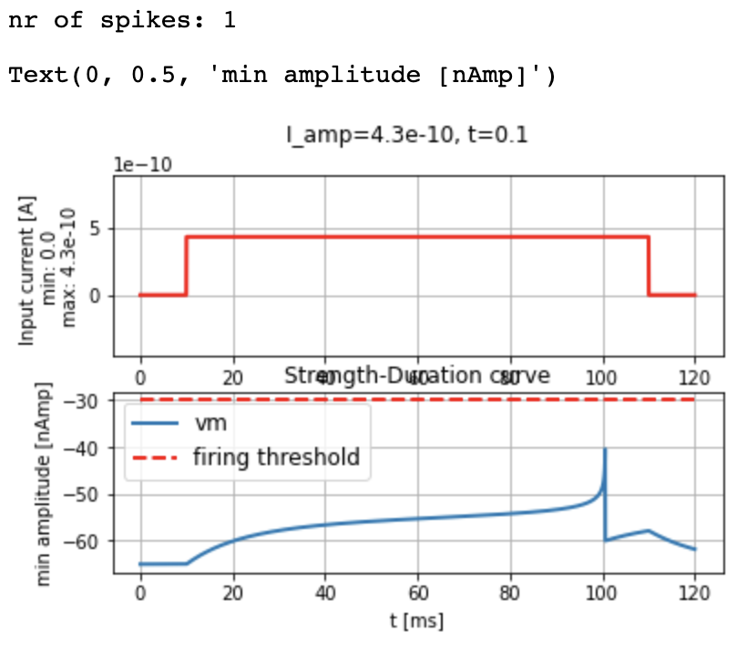

the amplitude-time graph for 100ms current duration

If we plot the amplitudes for all the different current durations, we get the following:

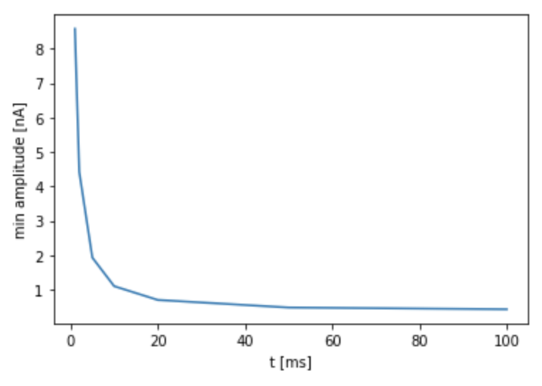

strength-duration curve

It's clear that that as we increase the current duration, we quickly approach the limit of the infinite-time minimum current calculated before, but as we make the current impulses shorter, the minimum amplitude increases quite rapidly.

This concludes my attempt at the second batch of Python exercises in the [Neuronal Dynamics](https://neuronaldynamics.epfl.ch/) book.