This short blog post includes a brief discussion of the Leaky Integrate and Fire (LIF) model of neurons along with my (attempted) solutions to the exercises from the book [Neuronal Dynamics](https://neuronaldynamics.epfl.ch/).

Theoretical neuroscience is amazing. Just imagine, the human brain is perhaps the most complicated machine in the world (or at least in the world we currently understand) and its fundamental building blocks (neurons) can be described with relatively simple equations! And these equations can then be used to simulate the behavior of neurons! If that isn't amazing, I don't know what is.

Speaking of models of neurons, one of the simplest ones (and perhaps the most commonly known), is the Leaky Integrate and Fire model. This model consist of two main components:

1. a description of an action potential
2. a description of spike generation.

To fully understand what that means, let's quickly recap the basics of neurons (step-by-step): neurons receive input from other neurons in the form of electrochemical spikes → these spikes change the membrane potential of the receiving neuron → if the membrane potential reaches a certain threshold, the neuron generates a new spike (aka action potential).

So the LIF model can be thought of as describing the bare minimum of what makes a neuron a neuron. Mathematically, the LIF neuron is described by the following equation:

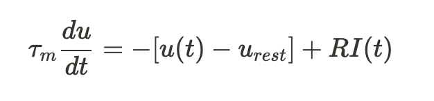

You might have come across this equation when describing RC circuits (or not). In the theoretical neuroscience context, this is the first order linear differential equation describing a passive membrane potential $u(t)$, where $\tau_m=RC$ is the characteristic decay time, $R$ is the leak resistance, $I(t)$ is the input current, and $u_{rest}$ is the resting potential. The only thing remaining is some threshold voltage $\upsilon$ which is then reset to $u_{rest}$. This can be described mathematically as

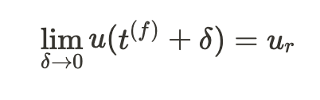

Where $t^{(f)}$ is the time of the firing (after the voltage reached the threshold), $u_r$ is the reset voltage, and $\delta$ is just a small amount of time right after the spike, so in the limit as $\delta$ goes to zero, the spike appears to be instantaneous (which is a simplification of what actually happens when a neuron fires, but for our purposes this simplification is just what we need).

To make this description complete, here is the solution to the differential equation above:

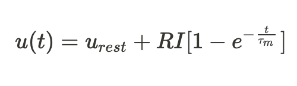

Ok, now we should have enough information to try and solve the [exercises](https://neuronaldynamics-exercises.readthedocs.io/en/latest/exercises/leaky-integrate-and-fire.html) from the [book above](https://neuronaldynamics.epfl.ch/).

### 1.0 Setting up the model

Since this is the first of many exercises, the authors provide a very detailed setup of the various packages that are used in the simulation.

```python
%matplotlib inline
import brian2 as b2
import matplotlib.pyplot as plt
import numpy as np
from neurodynex3.leaky_integrate_and_fire import LIF
from neurodynex3.tools import input_factory, plot_tools

LIF.getting_started()
LIF.print_default_parameters()
```

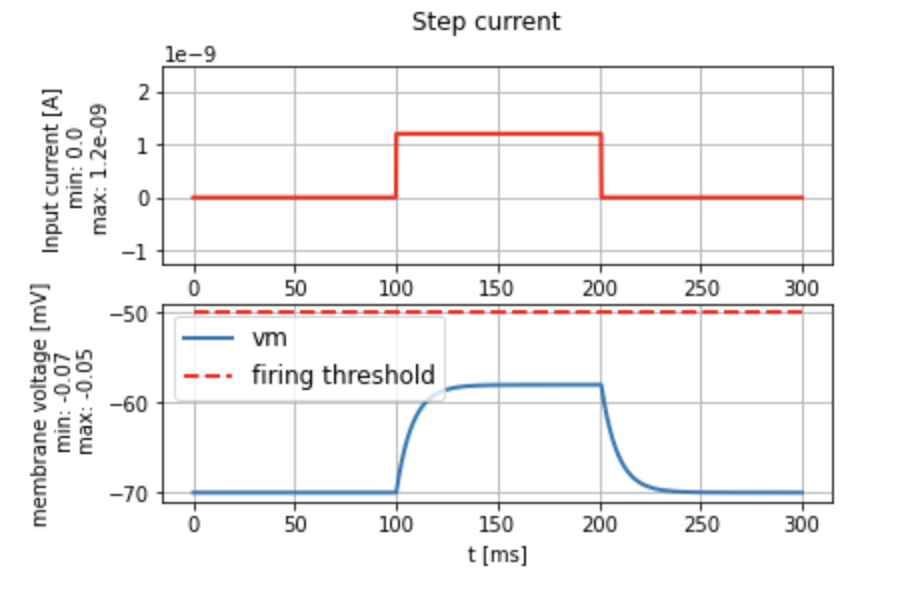

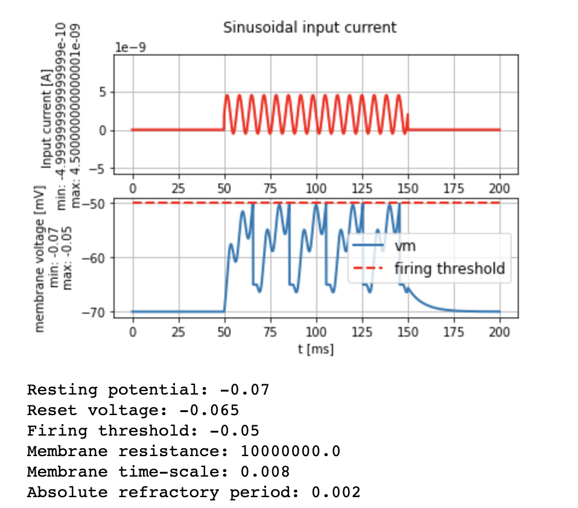

These two figures show the current and membrane voltage graphs for a step current and a sinusoidal current acting as the $I(t)$  (input current) from the equation above. The voltage graphs also show the threshold voltage and what happens it is reached (bottom plot). The bottom plot also shows the default neuron parameters.

### 1.1 Minimal current

This exercise asks us to find the minimal amplitude of the input step current (left plot) that would trigger a spike (based on the default parameters). I think the simplest way to do that would be to look at the difference between the **resting potential** and the **firing threshold voltage** and then use Ohm's law to figure out the current needed against that change in voltage. Mathematically, this would be

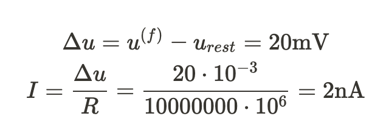

Note: the membrane resistance above (bottom plot) was in Mohms. It turns out that this is exactly the input current we need and plugging it in to the code gets us:

```python
import brian2 as b2
from neurodynex3.leaky_integrate_and_fire import LIF
from neurodynex3.tools import input_factory

# create a step current with amplitude = I_min
step_current = input_factory.get_step_current(
    t_start=5, t_end=100, unit_time=b2.ms,
    amplitude=(I_min))  # set I_min to your value

# run the LIF model.
# Note: As we do not specify any model parameters, the simulation runs with the default values
(state_monitor,spike_monitor) = LIF.simulate_LIF_neuron(input_current=step_current, simulation_time = 200 * b2.ms)

# plot I and vm
plot_tools.plot_voltage_and_current_traces(
state_monitor, step_current, title="min input", firing_threshold=LIF.FIRING_THRESHOLD)
print("nr of spikes: {}".format(spike_monitor.count[0]))  # should be 0
```

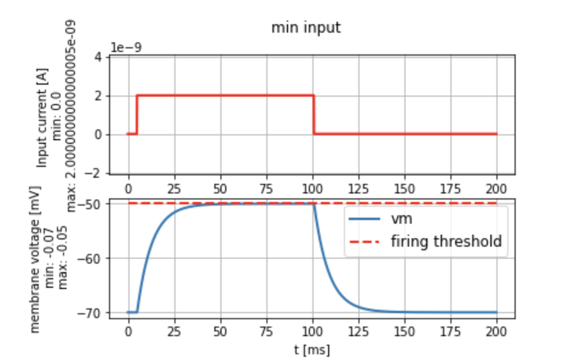

Note: the simulation time in the exercise is set to 100ms which would produce a plot without the spike, but I wanted to see that a spike would actually be generated.

### 1.2 f-I Curve

The f-I curve is quite self-explanatory, it is a curve that shows us the relationship between the firing rate and the input current. The idea is that as you increase the input current, the firing threshold will be reached sooner, hence more spikes in a fixed amount of time. We can model this with the code above by running multiple simulations with different input currents. The firing rate will then be the number of spikes divided by the time of the simulation. In code, this can look like:

```python
simulation_time =  500 * b2.ms
firing_rates = []

for i in range(0, 1000):
    I_in = i * b2.nA

    # create a step current with amplitude = I_min
    step_current = input_factory.get_step_current(
        t_start=5, t_end=100, unit_time=b2.ms,
        amplitude=I_in)  # set I_min to your value

    # run the LIF model.
    # Note: As we do not specify any model parameters, the simulation runs with the default values
    (state_monitor,spike_monitor) = LIF.simulate_LIF_neuron(input_current=step_current, simulation_time = simulation_time, abs_refractory_period = 3 * b2.ms)

    firing_rate = spike_monitor.count[0] / simulation_time
    firing_rates.append(firing_rate)

plt.plot([i for i in range(0, 1000)], firing_rates)
plt.show()
```


Just a couple of comments: 

- the line starts at 0 as expected (and actually remains at zero until the minimum current is reached, although it is hard to see that here)
- the firing rate increases until a threshold firing rate is reached (this makes sense since there is 3ms window where no additional spikes may be generated (given by the refractory period), therefore once there is a spike every 3ms, increasing the input current doesn't change anything)

### 1.3 **Estimating LIF neuron parameters**

This exercise is less about finding a concrete solution to a problem and more about getting a visual intuition about what the specific simulation parameters will produce. If we look back to section **1.0** underneath the bottom plot, we see the parameters that specify a LIF neuron. These include:

- resting potential
- reset voltage
- firing threshold
- membrane resistance
- membrane time-scale
- absolute refractory period

Looking at the plots produced by running `plot_tools.plot_voltage_and_current_traces()` with a random LIF neuron, we can try to estimate the parameters above.

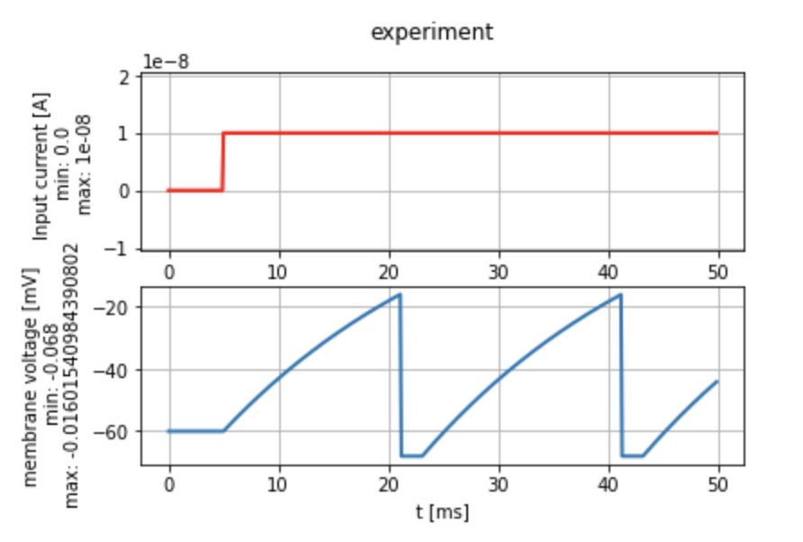

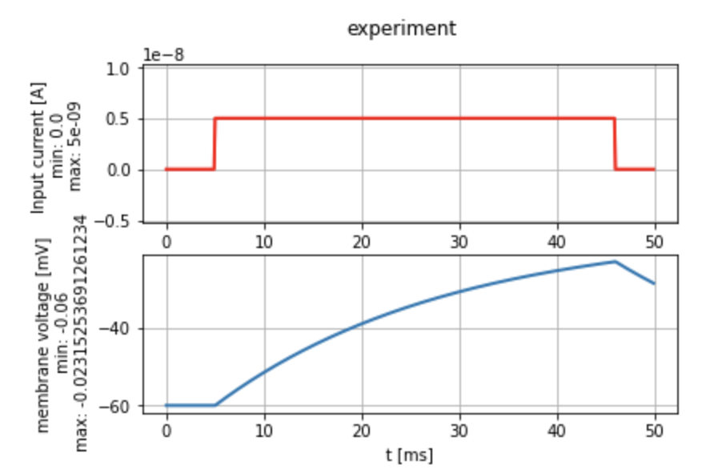

We're actually just going to use the bottom graph to estimate the LIF parameters. Firstly, resting potential is -60mV (where the blue line starts), then we can also see that the reset voltage is probably around -64mV (the two other horizontal segments). The firing threshold is likely ~-18mV (the point where the voltage suddenly starts decreasing rapidly). From this plot, we can also determine the absolute refractory period, which seems to be around 2ms (the length of the short horizontal segments). For the membrane resistance, we can turn to our calculation in part **1.1** to see that calculating the resistance requires firstly, the voltage difference between the resting potential and the firing threshold and secondly, the minimal current. This experimentation got me to a value for the minimal current at ~5nA (bottom figure), which would make the membrane resistance ~8.4Mohm. Finally, we have the membrane time-scale. Firstly, what is that? It's actually just the parameter $\tau_m$ from the differential equation above. If we take a look at the solution of the differential equation again:


we see that we might get the value for $\tau_m$ from the graph if we knew what the value of the membrane potential was when $t=\tau_m$ (remember that for very large $t$, the exponential component vanishes, and we're left with $u(t)=u_{rest}+RI$. This gives us

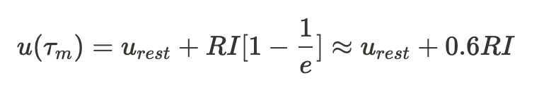

Also, we actually defined $\Delta u=RI$, meaning that $\tau_m$ is the time where the voltage curve is approximately 60% of the maximum voltage (Note: we are still working with the minimal current and the bottom plot). This means that the membrane time-scale is around 28ms. If we look at the real values, we see that the estimations weren't that far off.

```
Resting potential: -0.06
Reset voltage: -0.068
Firing threshold: -0.016
Membrane resistance: 9000000.0
Membrane time-scale: 0.024
Absolute refractory period: 0.002
```

### 1.4 **Sinusoidal input current and subthreshold response**

This exercise replaces the step input current with a sinusoidal one (the title kind of spoils that one). The first part of the question asks us to inject a sinusoidal input current to the LIF neuron with the following code:

```python
# note the higher resolution when discretizing the sine wave: we specify unit_time=0.1 * b2.ms
sinusoidal_current = input_factory.get_sinusoidal_current(200, 1000, unit_time=0.1 * b2.ms,
                                            amplitude= 2.5 * b2.namp, frequency=250*b2.Hz,
                                            direct_current=0. * b2.namp)

# run the LIF model. By setting the firing threshold to to a high value, we make sure to stay in the linear (non spiking) regime.
(state_monitor, spike_monitor) = LIF.simulate_LIF_neuron(input_current=sinusoidal_current, simulation_time = 120 * b2.ms, firing_threshold=0*b2.mV)

# plot the membrane voltage
plot_tools.plot_voltage_and_current_traces(state_monitor, sinusoidal_current, title="Sinusoidal input current")
print("nr of spikes: {}".format(spike_monitor.count[0]))
```

which produces something that looks like this:

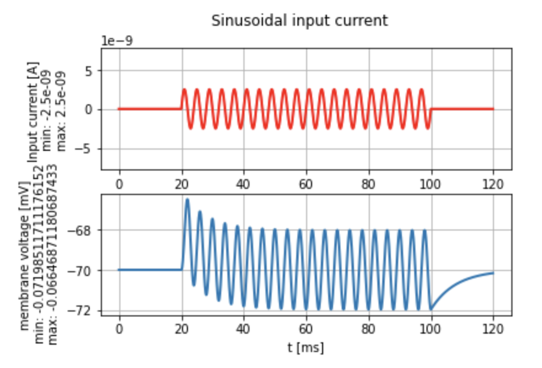

We are meant to determine the phase and amplitude of the membrane voltage. We can estimate the amplitude straight way by taking a look at where the voltage becomes easy to read (in this case it's approx. 2mV).

The phase of the membrane voltage is taken with respect to the input current. If you imagine a vertical line going from the blue curve to the red curve, we can estimate the phase difference by saying that the membrane sinusoid is shifted slightly to the right, by approximately a quarter of one full oscillation (one full oscillation is 4ms, therefore the phase shift is approximately 1ms)

The last couple of exercises ask us to plot the input frequencies between 1Hz and 10Hz and the phase shift between input current and membrane potential. This is the plot for an input current having frequency 5Hz.


The phase difference of the two curves becomes more apparent at higher input current frequencies. The last question asks whether this corresponds to a high-pass or a low-pass filter. If we take a look at the plot below, showing all frequency inputs from 1Hz to 10Hz, it seems that the higher frequencies actually result in lower amplitudes, so that should mean that this corresponds to a low-pass filter, which decreases the amplitudes of signals at higher frequencies.

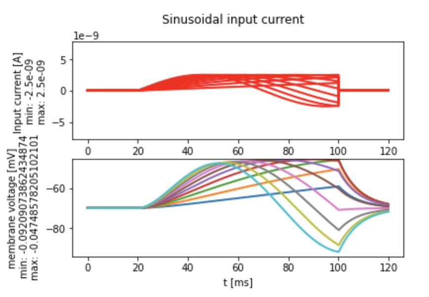

That concludes my solutions to the first set of questions in [Neuronal Dynamics](https://neuronaldynamics.epfl.ch/). (Note: I am not certain that these are the correct solutions)