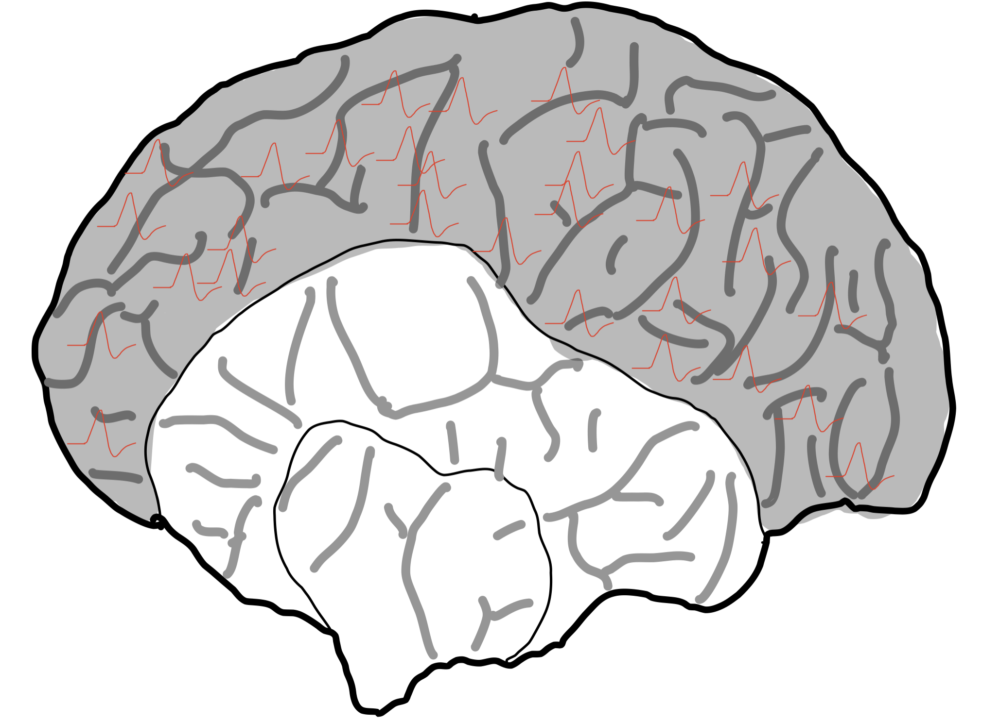
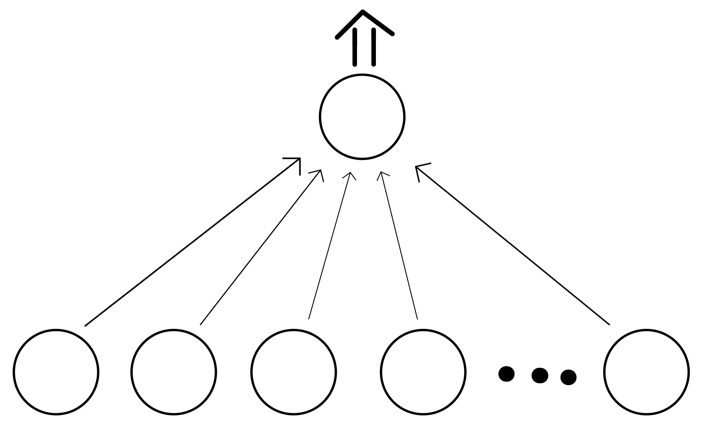

So where do we start when we want to talk about human intelligence? Let’s first establish what part of the brain we want to focus on. There are many difficult sounding words to describe all the different parts of the brain, but since we’re at the beginning, it is useful for us to use the simple distinction that the brain is essentially divided into two parts: 
- the old brain 
- the new brain. (sounds like a religion doesn’t it?)

The old brain developed over hundreds of millions of years and controls all the basic functions necessary for survival, from emotions to the desire to reproduce. The new brain, AKA the neocortex, is the organ of intelligence, it is what allowed us to develop language, to understand mathematics, and to fly into space, (pretty cool stuff for such a small lump of tissues).
Everything we perceive, our thoughts and ideas are the activity of neurons. At the end of the day, your world and my world are just electrical spikes in our heads. It’s weird to think about it that way, and to be fair it only raises more questions than answers, but that’s the exciting thing about studying intelligence! There is so much we have yet to discover!
Our brain does so much more than just create thoughts and process perceptions, though. It also stores information and creates a predictive model of the world. Information is stored in the connections between neurons, called synapses. Unfortunately, it is not as simple as putting something in a box and leaving it there for later retrieval. Information is distributed throughout many areas of the neocortex and one piece of information is likely stored multiple times at many different locations so that if one region of the brain stopped working, you would still be able to recall that piece of information.
You might have noticed me say the term predictive model of the world. Now, what does that mean exactly? The key term here is predictive. At every waking moment, your brain creates predictions about what the next input is going to be. If you are sitting in your room, think about turning your head. You will automatically imagine what the room will look like if you turn your head to one side or the other, and when you actually do turn your head and find something out of the ordinary, you will notice it immediately, because it wasn’t part of your model of the room. The *turning your head* exercise is just an example, you usually don’t notice predictions taking place, but your brain does this all the time. It works thanks to a very elegant mechanism called dendrite spikes. 

Very briefly, a neuron can be thought of as having 3 main parts: the body, the axon, and dendrites. The body is what keeps the cell alive and it is where its DNA is stored. The axon is basically a biological wire through which chemical and electrical pulses travel, sort of like a highway for brain signals. Lastly, you can think of dendrites as little branches that connect to other neurons and form synapses. Usually, when spikes travel down multiple neurons, each neuron induces a spike of the next one, and it often takes multiple neurons firing at the same time and connecting to one neuron to make it fire as well.

In the case of prediction, however, it seems to be the case that multiple synapses connected to one neuron spike at the same time, but don’t produce enough potential so that the neuron generates a new spike. However, they do produce enough potential to make the neuron more likely to spike when it receives additional input. This neuron then fires more quickly than other neurons when the prediction was correct. That was quite a mouthful, so I’ll try to reiterate. Imagine runners preparing for a race. Before a race, all runners are given a countdown before the race begins. Now imagine that only one of the runners was given the countdown and the rest would only hear the GO. Intuitively, the runner that has been given the countdown will be more prepared for the start of the race, and while other runners are still processing whether they can go or not, the runner that heard the 3, 2, 1, GO will be way faster. This is the basis of prediction and it also explains how you get more efficient at completing tasks you’ve done repeatedly in the past. Your brain has a very solid model of the world and it uses this model to make predictions about what it is going to sense next and accordingly prepares the responses to the expected inputs. 

In a way, we are all living in a simulation of our predictive models of the world. That’s initially quite unsettling to think about, but then, it also makes you appreciate why different people have different opinions and why they react differently to different situations. This then begs the question, is there an **ideal** set of models of the world? And if we ever build intelligent machines that work on similar principles to the neocortex, what's the optimal starting point to ensure the most objective view of the world (or of the task we want the machine to perform)?

Note: Information presented here is originally from the book *A Thousand Brains* by Jeff Hawkins and this post should be considered as a summarization of one of the topics discussed in it. I wholeheartedly recommend reading the book for yourselves as I am simply sharing my enthusiasm for theoretical neuroscience, but cannot possibly provide a more detailed description of the theoretical framework Jeff and his team at [Numenta](https://numenta.com/) developed.