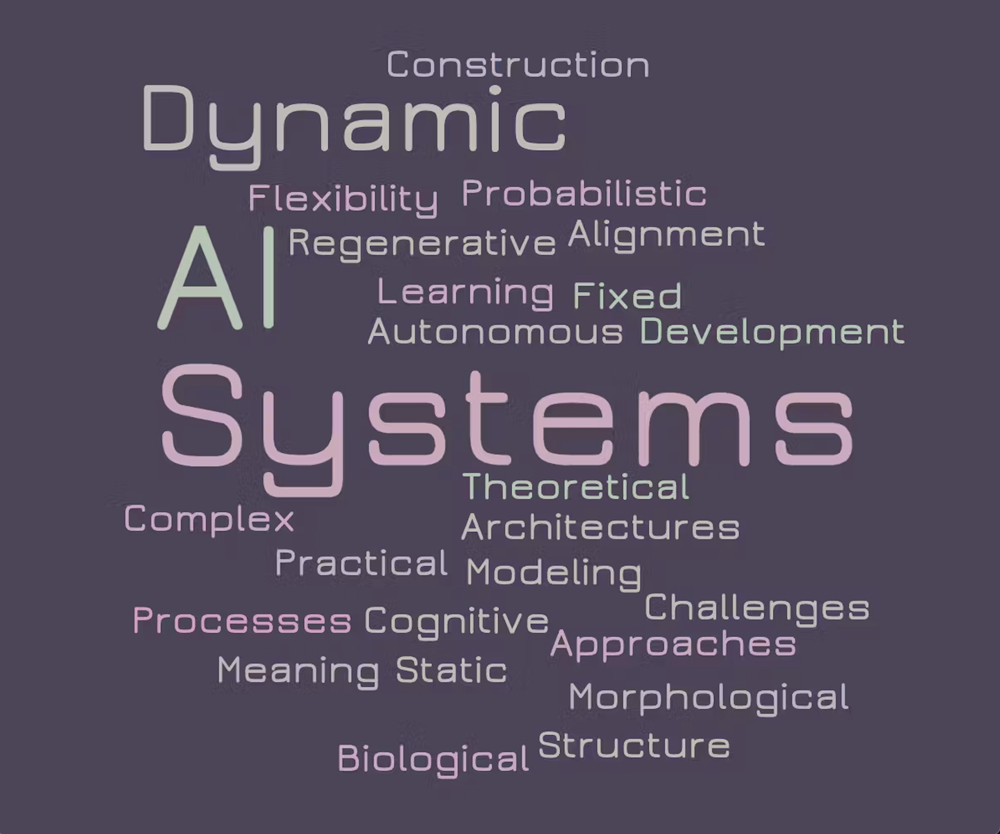
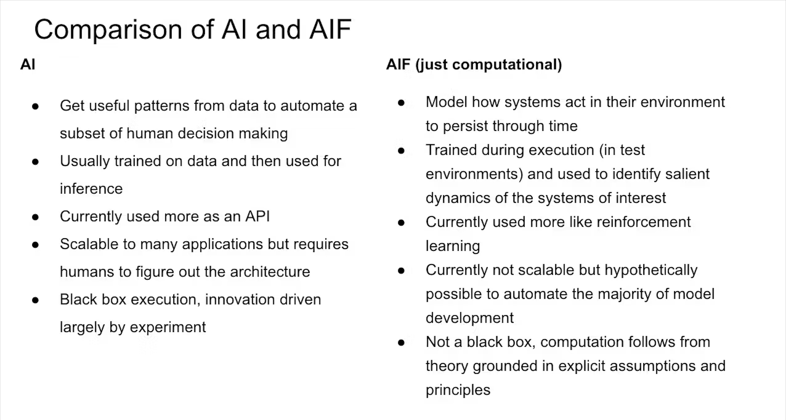

**Driving Questions**

* How can we shift our perspective from static to dynamic processes in AI development (and alignment)?
* What are the opportunities/limitations of probabilistic approaches in cognitive modeling and structure learning?
* How might the morphological development of complex dynamical systems inform the development of artificial autonomous systems?
* In what ways is current AI dynamic and static, and what are the implications of this?
* How should the fixed parameters of autonomous systems be determined?

Deep neural networks rely on learning the weights associated with functions applied to incoming signals that are then transformed into some discrete probability distribution representing a belief (e.g. Does this image contain X? What is the next word in the sequence? Which pixels correspond to noise given this particular input?). This is ultimately a form of amortized inference, you start with an observation and then you have a giant function that returns an output. It is clear that this approach has been extremely successful in a wide range of domains and as these models scale and can do more and more things, attention is shifting towards questions of alignment and the effects of further progress along this thread.

To contrast the development of modern AI models, let’s consider active inference (AIF) and more broadly probabilistic cognitive modeling. The approaches taken here have so far been more targeted towards **understanding** biological systems rather than on the development of synthetic cognition, but as more research lands at the [intersection of AI and CogSci](https://arxiv.org/abs//2306.12672), it’s important to consider what these probabilistic frameworks have to offer. I think when considering alignment and the future of AI, the discussion should focus on the structure and dynamics (both internal and external) associated with the models we develop and the systems they influence, which will naturally lead to a consideration of probabilistic cognitive modeling (including, but not limited to, active inference).

Here’s a simple comparison of current AI approaches and active inference (a similar comparison works for probabilistic cognitive modeling in general).

